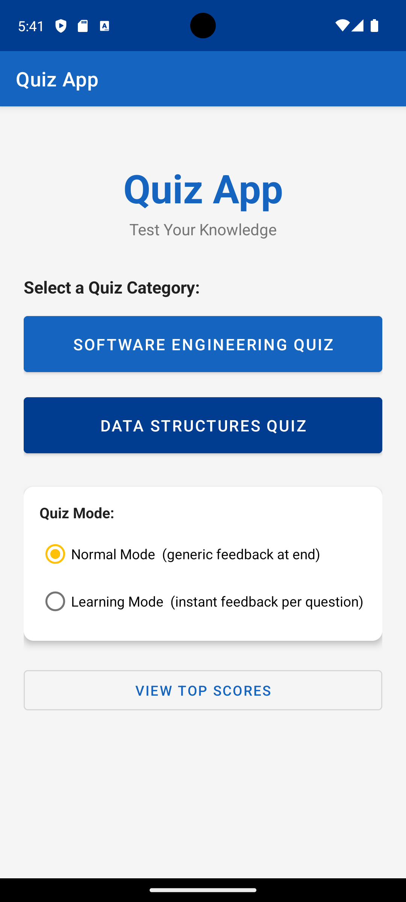
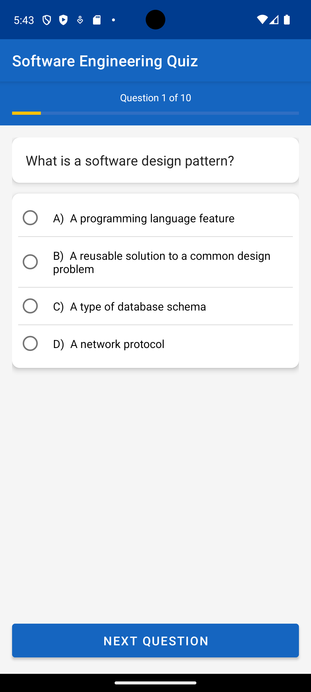
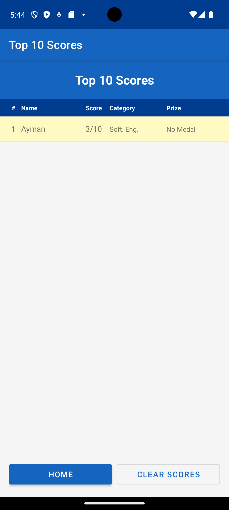
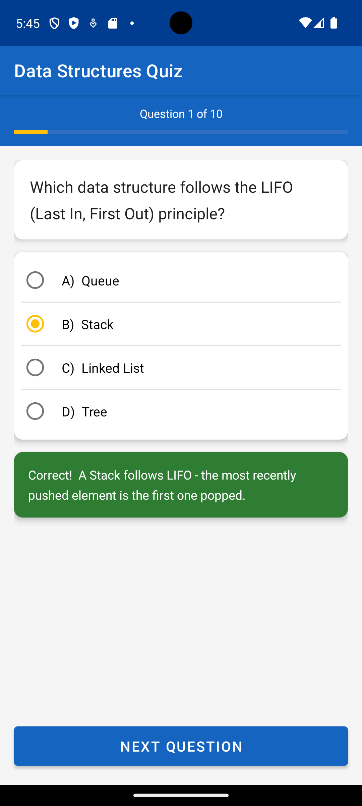

# Android Quiz App

A simple and interactive quiz application built for Android.

## About

This project is an Android quiz app that lets users answer multiple-choice questions, track their score, and review their results.

## Features

- Multiple-choice quiz questions
- Score tracking
- Clean and user-friendly interface
- Results screen at the end of the quiz

## Tech Stack

- Language: Java / Kotlin
- Platform: Android
- IDE: Android Studio

## Getting Started

1. Clone or download this repository.
2. Open the project in Android Studio.
3. Build and run on an emulator or physical Android device.

## Project Files

The project source files are organized in the standard Android Studio structure.

## Screenshots

### Start Screen

### Quiz Screen

### Learning Mode Feedback

### Result Screen

### Leaderboard

## Author

aymanelmoudden177-lab

## License

This project is open source and available for educational purposes.
